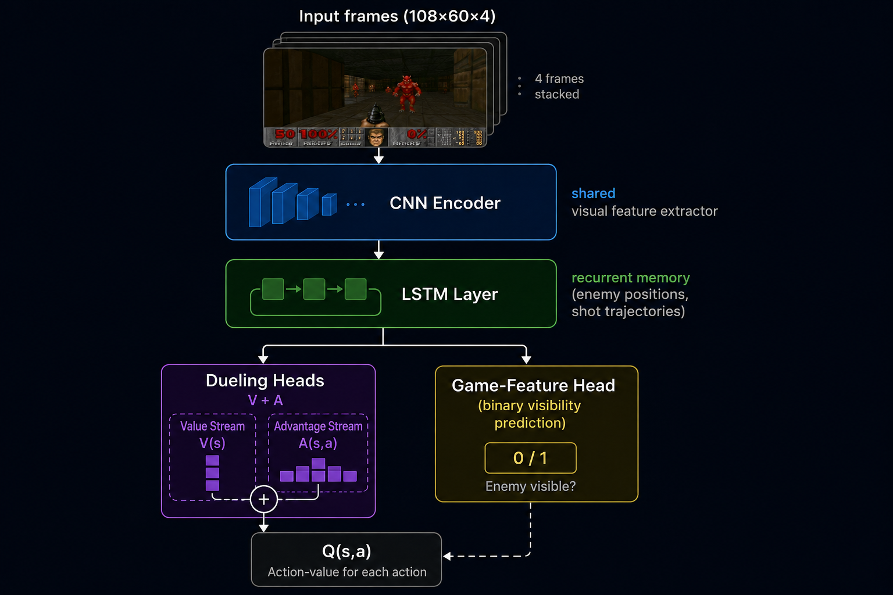
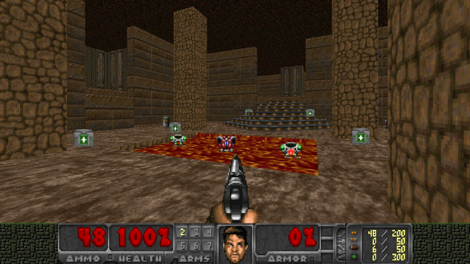

# 🎮 FreeDoom — Deep Reinforcement Learning for Deathmatch Combat

> **Training deep RL agents to fight in a VizDoom deathmatch environment using PPO and Dueling DRQN.**

**Authors:** Ouali Yassine & Mellak Khadija  
**Institution:** Department of Intelligent Systems, ENSA Fez — University of Sidi Mohammed Ben Abdellah  
**Contact:** yassine.ouali@usmba.ac.ma · khadija.mellak@usmba.ac.ma

---


## Overview

FreeDoom investigates two complementary deep reinforcement learning strategies for first-person combat in a [VizDoom](https://vizdoom.cs.put.edu.pl/) deathmatch scenario:

| Agent | Algorithm | Environment | Training Steps | Key Result |
|---|---|---|---|---|
| **PPO Agent** | Proximal Policy Optimization | Spatially constrained arena (600×600 units), 2 bots | 301 056 | 50% success rate (both enemies eliminated) |
| **Arnold** | Dueling Double Deep Recurrent Q-Network (Dueling DRQN) | Full deathmatch map, 4 bots, 5 rotating maps | 3 271 025 | 16.8 mean kills/episode, K/D = 10.68 |

The core research question is: *can a simpler on-policy method (PPO) with spatial constraints match the performance of a richer value-based recurrent architecture (Dueling DRQN) on this sparse, adversarial task?*

---

## Agents

### 1. PPO Agent (`doom_ppo_v1_3`)

Uses **Proximal Policy Optimization** with a CNN policy (Stable-Baselines3). A key design choice is a **spatial constraint**: the agent is bounded to a 600×600 unit arena centered on its spawn point, preventing aimless map wandering and forcing enemy encounters. The reward was iteratively refined over 4 training experiments (`Essai 1` → `Essai 4`).

### 2. Arnold (Dueling DRQN)

Uses a **Dueling Double Deep Recurrent Q-Network** on the full deathmatch map. Architecture extensions over standard DQN:
- **Dueling streams** — separates Q-value into state-value V(s) and advantage A(s,a)
- **LSTM layer** — maintains memory of recent events (enemy positions, shot trajectories)
- **Auxiliary game-feature head** — predicts binary enemy visibility, acting as a perceptual regularizer (inspired by [Lample & Chaplot, 2016](https://arxiv.org/abs/1609.05521))

---

## Setup — Scenario Files & Pretrained Model

### VizDoom Scenario Files

The PPO approach uses two custom scenario files that **must be manually copied** into
VizDoom's local `scenarios/` folder before running any script:

| File | Description |
|---|---|
| `deathmatch_mine.cfg` | VizDoom configuration (game variables, buttons, episode settings) |
| `deathmatch_mine.wad` | Custom Doom map file |

**How to install them:**

1. Locate your VizDoom `scenarios/` folder. It typically lives at:

```
C:\Users\<YourUsername>\AppData\Local\Programs\Python\Python312\Lib\site-packages\vizdoom\scenarios\
```

2. Copy both files there:

```
deathmatch_mine.cfg  →  .../vizdoom/scenarios/deathmatch_mine.cfg
deathmatch_mine.wad  →  .../vizdoom/scenarios/deathmatch_mine.wad
```

3. No other configuration is needed — `doom_env.py` references these files by name and VizDoom will find them automatically.

> ⚠️ If VizDoom raises a `FileNotFoundError` on `deathmatch_mine.cfg`, the files are not in the right folder. Double-check the path above for your Python version and username.

---

### Pretrained Model — Skip Training, Test Directly

`doom_ppo_v1_3.zip` is the final trained PPO model (Essai 4 — the last and best iteration of the PPO approach). It can be loaded and tested **immediately** without running the training script (which takes ~14 hours).

**To test the pretrained agent on 10 episodes:**

```bash
# Make sure doom_ppo_v1_3.zip is in the same directory as test.py
python ppo_approach/test.py
```

This will open a visible game window and run 10 full episodes, printing step-level stats and a per-episode summary. The agent uses `deterministic=True` — it plays what it has genuinely learned, with no random exploration.

**To train from scratch instead** (optional, ~14 hours):

```bash
python ppo_approach/train.py
```

This will overwrite `doom_ppo_v1_3.zip` with a freshly trained model and save intermediate checkpoints every 50 000 steps to `./checkpoints/`.

| File | Purpose | Time |
|---|---|---|
| `doom_ppo_v1_3.zip` | Ready-to-use pretrained model | Instant load |
| `ppo_approach/test.py` | Evaluate the agent (5 or 10 episodes) | ~5 minutes |
| `ppo_approach/train.py` | Train from scratch | ~14 hours |

---

## Environment Design — PPO Agent

### VizDoom Configuration

| Parameter | Value |
|---|---|
| Scenario | `deathmatch_mine.cfg` / `deathmatch_mine.wad` |
| Difficulty | Skill level 3 (intermediate) |
| Episode timeout | 4 200 game tics |
| Number of bots | 2 |
| Training resolution | 320×240 (HUD disabled) |
| Inspection resolution | 640×480 |
| Training mode | `ASYNC_PLAYER` |
| Test mode | `PLAYER` |

### Observation Space

Raw VizDoom screen buffers are preprocessed at every step:

1. Transpose `(C, H, W)` → `(H, W, C)` if needed
2. Grayscale → RGB conversion if single-channel
3. Clip to 3 channels
4. Resize to **84×84** pixels (OpenCV)
5. Cast to `uint8`

Final observation space: `Box(0, 255, shape=(84, 84, 3), dtype=uint8)`

> Terminal observations (agent death or zone violation) return a black frame of zeros.

### Action Space

8 discrete macro-actions (`Discrete(8)`), each executed for **4 consecutive game tics** (frame skip = 4):

| Index | Action | Buttons |
|---|---|---|
| 0 | Move forward | `MOVE_FORWARD` |
| 1 | Move backward | `MOVE_BACKWARD` |
| 2 | Strafe left | `MOVE_LEFT` |
| 3 | Strafe right | `MOVE_RIGHT` |
| 4 | Turn left | `TURN_LEFT` |
| 5 | Turn right | `TURN_RIGHT` |
| 6 | Attack | `ATTACK` |
| 7 | Move forward + Attack | `MOVE_FORWARD` + `ATTACK` |

### Game Variables

Eight variables are tracked at each step:

| Idx | Variable | Type | Role |
|---|---|---|---|
| 0 | `KILLCOUNT` | Int | Kill reward signal |
| 1 | `HEALTH` | Int | Damage & low-health penalty |
| 2 | `ARMOR` | Int | Reserved (unused) |
| 3 | `SELECTED_WEAPON` | Int | Reserved (unused) |
| 4 | `S_WEAPON_AMMO` | Int | Ammunition penalty |
| 5 | `POSITION_X` | Float | Spatial constraint |
| 6 | `POSITION_Y` | Float | Spatial constraint |
| 7 | `DAMAGECOUNT` | Int | Damage-received penalty (cumulative delta) |

> **Important:** `DAMAGECOUNT` tracks cumulative damage *received* by the agent since episode start, not damage inflicted on enemies. The reward function uses the per-step delta `Δd = DAMAGECOUNT_t − DAMAGECOUNT_{t-1}`.

### Spatial Constraint

The episode terminates immediately with a −1.0 zone penalty if the agent exceeds 300 game units in either axis from its spawn point:

```
|x_t − x_0| > 300  OR  |y_t − y_0| > 300  →  episode terminated
```

This creates a pseudo 600×600 unit bounding box that prevents aimless wandering and increases enemy encounter density during early training.

---

## Environment Design — Arnold (Dueling DRQN)

### VizDoom Configuration

| Parameter | Value |
|---|---|
| Scenario | VizDoom deathmatch (full map) |
| Number of bots | 4 |
| Maps | 5 rotating maps |
| Episode timeout | 2 100 game tics |
| Spatial constraint | None — full map exploration |

Arnold operates on an **unrestricted full deathmatch map**, relying on reward shaping (distance bonus, stale penalty) rather than hard spatial boundaries to encourage active exploration.

### Observation Space

| Parameter | Value |
|---|---|
| Resolution | 108×60 RGB |
| Frame stack | 4 consecutive frames |
| Frame skip | 4 game tics per action |
| Final input shape | `(108, 60, 4)` |

The 4-frame stack gives Arnold a short-term temporal window, while the LSTM layer (see Architecture below) extends memory further across the full episode.

### Action Space

Arnold uses a **factored action space** combining three independent sub-actions simultaneously, giving broader tactical coverage than the PPO agent's flat 8-action set:

| Sub-action Group | Options |
|---|---|
| Turn + Move | Turn left, Turn right, Move forward, Move backward, No move |
| Attack | Attack, No attack |
| Strafe | Strafe left, Strafe right, No strafe |

This factored design allows simultaneous strafing and turning — standard Doom combat mechanics not available in the PPO action set.

### Training Configuration

| Parameter | Value |
|---|---|
| Algorithm | Dueling DRQN (Double DQN + LSTM) |
| Replay buffer | 100 000 transitions |
| Batch size | 32 sequences |
| Recurrent unrolls | 4 steps |
| Learning rate | 2×10⁻⁴ (Adam) |
| Target network update | Every 1 250 train steps (~5 000 env steps) |
| ε-greedy schedule | 1.0 → 0.10 over first 500 000 env steps |
| Discount γ | 0.99 |
| Total training steps | 3 271 025 |

### Architecture: Dueling DRQN with Game-Feature Head

Arnold extends standard DQN with three stacked components:


**Dueling streams** — The Q-value is decomposed into:
```
Q(s, a) = V(s) + A(s, a) − mean_a'[A(s, a')]
```
This improves value estimates in states where action choice has little impact (e.g., navigating between encounters).

**LSTM layer** — Replaces fully-connected layers with an LSTM that processes sequences of frame-stacked observations, enabling the agent to track enemy positions and anticipate shots beyond what a fixed 4-frame stack can encode. This is critical in VizDoom's partially observable setting where enemies can leave the field of view.

**Auxiliary game-feature head** — Branches off the shared LSTM hidden state to predict binary visibility indicators (is an enemy currently visible?). Inspired by [Lample & Chaplot, 2016], this head acts as a perceptual regularizer, forcing the visual encoder to learn semantically meaningful scene representations beyond pure Q-value optimization. The game-feature loss converges independently of the TD loss, confirming the two objectives do not interfere.

---

## Reward Functions

### PPO Agent — Per-Step Reward

```
r_t = r_kill + r_surv + r_time + r_dmg + r_ammo + r_zone + r_death
```

| Component | Condition | Value | Purpose |
|---|---|---|---|
| Kill bonus | Per new kill | **+1.0** | Primary objective |
| Survival bonus | Every step | +0.005 | Discourage passive death |
| Time penalty | Every step | −0.001 | Discourage idling |
| Damage penalty | Per damage unit Δd | −0.02 × Δd | Penalize absorbing hits |
| Ammo penalty | Per ammo unit Δa | −0.003 × Δa | Discourage random firing |
| Zone penalty | Exit 300-unit bound | −1.0 | Hard spatial constraint |
| Death penalty | Agent dies | −0.3 | Penalize terminal failure |
| Low-health penalty | Health < 25 | −0.01/step | Avoid dangerous situations |

### Arnold — Per-Step Reward

```
r_t = r_kill + r_death + r_dist + r_stale + r_health
```

| Component | Value | Purpose |
|---|---|---|
| Kill bonus | **+30** | Primary combat objective |
| Death penalty | −10 | Penalize terminal failures |
| Distance bonus | +0.005 × d | Encourage map exploration |
| Stale penalty | −0.1/step | Discourage standing still |
| Health pickup | +1 | Reward self-preservation |

> The kill bonus is set to +30 (vs +1 for PPO) to reflect the denser, longer episodes of the full deathmatch setting. Kill–reward Pearson correlation r = **0.984**, confirming the reward is well-aligned with the primary objective.

---

## Installation

### Prerequisites

- Python 3.8+
- VizDoom (see [Setup](#️-setup--scenario-files--pretrained-model) for scenario file installation)
- CUDA-capable GPU recommended for training

### Install Dependencies

```bash
pip install vizdoom gymnasium stable-baselines3 opencv-python numpy torch tensorboard
```

> For Arnold (Dueling DRQN), additional dependencies used in `arnoldv2.ipynb` may be required (e.g. `jupyter`).

---

## Usage

### Training the PPO Agent

```bash
python ppo_approach/train.py
```

This will:
- Initialize `DoomEnv` in `ASYNC_PLAYER` mode
- Train a PPO agent with `CnnPolicy` for 300 000 timesteps
- Save checkpoints every 50 000 steps to `./checkpoints/`
- Log training metrics to `./ppo_doom_tensorboard/`
- Save the final model as `doom_ppo_v1_3.zip`

**Key hyperparameters (`train.py`):**

| Parameter | Value |
|---|---|
| Policy | `CnnPolicy` |
| Learning rate | 1e-4 |
| n_steps | 2048 |
| batch_size | 64 |
| gamma | 0.99 |
| Total timesteps | 300 000 |

### Monitoring PPO Training

```bash
tensorboard --logdir ./ppo_doom_tensorboard/
```

Key metrics to watch: `rollout/ep_len_mean`, `rollout/ep_rew_mean`, `train/approx_kl`, `train/clip_fraction`.

### Testing the PPO Agent

```bash
python ppo_approach/test.py
```

Runs 10 evaluation episodes with `deterministic=True` and renders a visible game window. Prints step-level stats every 50 steps and a full reward breakdown at the end of each episode.

### Training Arnold (Dueling DRQN)

Open and run `arnold_approach/arnoldv2.ipynb` in Jupyter. The notebook contains the full Dueling DRQN implementation, training loop, evaluation code, and loss/reward plotting.

Key metrics monitored during Arnold's training: `ep_reward`, `ep_kills`, `TD loss`, `GF loss` (game-feature head), `mean Q-value`, `K/D ratio`.

---

## Results

### PPO Agent — Essai 4 (`doom_ppo_v1_3`)

**Training (301 056 steps, ~13.85 hours):**

| Metric | Value |
|---|---|
| Final mean episode length | ~103.6 steps (+48% from start) |
| Final mean episode reward | ~0.38 (started at ~−0.2) |
| Peak episode reward | ~0.45 (at ~150k steps) |

**Test evaluation (10 episodes):**

| Episode | Reward | Kills | Steps | Outcome |
|---|---|---|---|---|
| 1 | 2.180 | 2 | 167 | Success |
| 2 | −0.324 | 0 | 84 | Failure |
| 3 | 2.180 | 2 | 167 | Success |
| 4 | −0.617 | 0 | 107 | Failure |
| 5 | −0.818 | 0 | 50 | Failure |
| 6 | 2.145 | 2 | 154 | Success |
| 7 | −0.004 | 0 | 168 | Failure |
| 8 | 2.180 | 2 | 167 | Success |
| 9 | −0.873 | 0 | 34 | Failure |
| 10 | 2.180 | 2 | 167 | Success |

**Summary: 5/10 success rate · Mean reward = 0.623 · Mean episode length = 126.5 steps**

### PPO Training Experiments Summary

| Experiment | Key Change | Outcome |
|---|---|---|
| Essai 1 | 5-action baseline, no health/ammo tracking | Proof-of-concept |
| Essai 2 (`doom_ppo_v1_1`) | Fixed `DAMAGECOUNT` as penalty (not bonus) | ~100k steps, unstable (ep_len 70–85) |
| Essai 3 (`doom_ppo_v1_2`) | Kill reward +50, survival bonus, time penalty | 1M steps / ~38h; degradation at 550k steps |
| Essai 4 (`doom_ppo_v1_3`) | Kill reward normalized to +1.0, ammo penalty, health tracking | **Final model — 50% success rate** |

### Arnold (Dueling DRQN) — Final Performance

| Metric | Value |
|---|---|
| Total training steps | 3 271 025 |
| Total episodes | 6 215 |
| Mean episode kills | **16.83** |
| Peak episode kills | **43** |
| Mean K/D ratio | **10.68** |
| % episodes with K/D > 1 | 86.8% |
| Greedy eval kills (final checkpoint) | **5.4 / episode** |
| Greedy eval K/D (final) | **5.40** |
| Mean episode reward | 503.0 |
| Peak episode reward | 1 307.3 |
| Mean TD loss | 0.2384 |
| Mean GF loss | 0.1915 |
| Peak mean Q-value | 24.07 |
| Final mean Q-value | 20.07 |
| Reward–kill correlation | **r = 0.984** |

**Phase-by-phase kill statistics (3.27M steps divided into 4 equal quartiles):**

| Phase | Steps | Mean Kills | Std | Max |
|---|---|---|---|---|
| Phase 1 | 0 – 0.82M | 16.81 | 6.55 | 43 |
| Phase 2 | 0.82 – 1.63M | 17.32 | 6.44 | 43 |
| Phase 3 | 1.63 – 2.45M | 16.07 | 5.50 | 38 |
| Phase 4 | 2.45 – 3.27M | 17.11 | 5.84 | 42 |

Mean kills remain stable across all phases while standard deviation narrows, confirming policy stabilization without catastrophic forgetting.

---

## Limitations

- **No outgoing damage signal** — VizDoom's default config does not expose damage inflicted on enemies; only kill events provide combat feedback. Custom ACS scripting in the WAD file would be needed for a richer intermediate signal.
- **Spatial constraint approximation** — The PPO agent's 300-unit bound is a rough proxy; a curriculum approach gradually expanding the accessible zone as skill improves would be more principled.
- **Insufficient training budget** — PPO clipping fraction never fell below 0.40, confirming the policy had not converged at 300k steps. Extending to 1M–5M steps is recommended. Arnold also appears to have reached a local behavioral plateau rather than a true optimum; 10M–20M steps may be needed.
- **Single-seed evaluation** — All training runs used one random seed; multi-seed experiments with statistical significance tests are needed for robust conclusions.
- **Limited PPO action space** — The 8 macro-actions omit strafing-while-turning and crouching; Arnold's factored action space handles this more flexibly.

---

## References

1. J. Schulman et al., "Proximal policy optimization algorithms," *arXiv:1707.06347*, 2017.
2. G. Lample and D. S. Chaplot, "Playing FPS games with deep reinforcement learning," *arXiv:1609.05521*, 2016.
3. M. Kempka et al., "ViZDoom: A Doom-based AI research platform for visual reinforcement learning," *IEEE CIG*, 2016.
4. M. Abadi et al., "TensorFlow: A system for large-scale machine learning," *OSDI*, 2016.
5. M. Towers et al., "Gymnasium: A standard interface for reinforcement learning environments," *NeurIPS*, 2025.
6. Z. Wang et al., "Dueling network architectures for deep reinforcement learning," *ICML*, 2016.
7. M. Hausknecht and P. Stone, "Deep recurrent Q-learning for partially observable MDPs," *AAAI*, 2015.
8. V. Mnih et al., "Human-level control through deep reinforcement learning," *Nature*, vol. 518, 2015.

---

## Demo





---

*FreeDoom — ENSA Fez, University of Sidi Mohammed Ben Abdellah*
